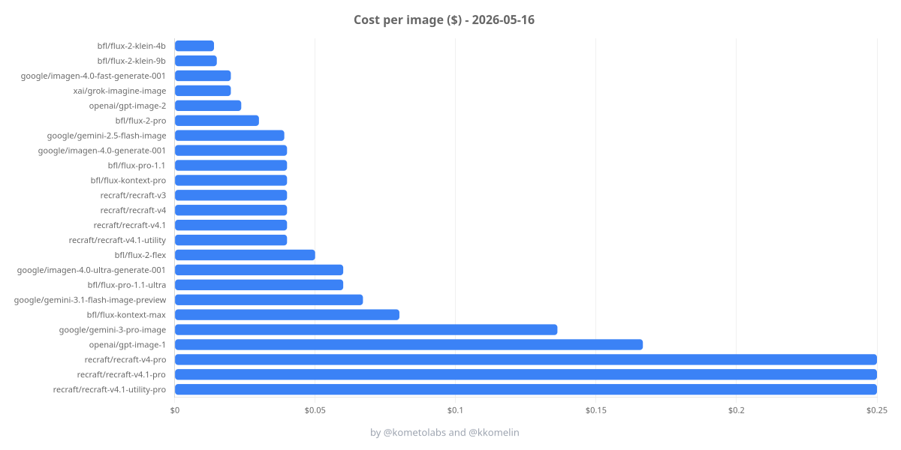
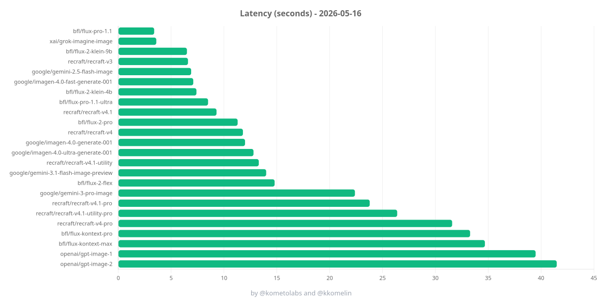

# AI Image Generation Cost Analysis

Benchmark image generation models behind Vercel AI Gateway, save the generated images, and produce a Markdown report with cost and latency per model.

A companion blog post with benchmark results and conclusions: [komelin.com/blog/ai-image-generation-cost-analysis](https://komelin.com/blog/ai-image-generation-cost-analysis)

## Results

Latest run - see the full table with per-model images in [results/report.md](./results/report.md).

[](./results/images/charts/cost.png)

[](./results/images/charts/latency.png)

## What It Does

- Runs multiple image generation models through a single CLI.
- Supports both `generateImage` and `generateText` image-producing models from the Vercel AI SDK.
- Saves generated images to `./results/images`.
- Generates square thumbnails to `./results/images/thumbnails`.
- Renders cost and latency bar charts to `./results/images/charts`.
- Writes a Markdown report to `./results/report.md`.
- Tracks provider-reported cost when available.

## Models Covered

Full list of the tested models [`src/models.ts`](./src/models.ts):

Provider-specific quirks and workarounds are documented in [MODEL-QUIRKS.md](./MODEL-QUIRKS.md).

## Requirements

- [Bun](https://bun.sh)

## Install

```bash
bun install
```

## Configure

### Create and add Vercel AI Gateway API Key

Create an API key at https://vercel.com/d?to=/[team]/~/ai-gateway/api-keys

```bash
cp .env.example .env
```

Set the `AI_GATEWAY_API_KEY` environment variable `.env.example`:

```bash
export AI_GATEWAY_API_KEY=your_key_here
```

### Configure benchmark

Edit [src/config.ts](./src/config.ts) to change:

- the benchmark prompt
- aspect ratio and size
- image count
- request delay
- output paths

Edit [src/models.ts](./src/models.ts) to enable or disable models or adjust model-specific options.

## Run

```bash
bun start
```

For development:

```bash
bun dev
```

### Add caption pills to images

Overlays a compact provider/model pill onto each saved image:

```bash
bun captions
```

Reads from `./results/images` and writes to `./results/images/captioned`. Pass `--input` / `--output` to override.

## Output

The CLI prints progress for each model and runs four phases:

1. **Generation** - calls each enabled model and saves outputs to `./results/images/`.
2. **Thumbnails** - resizes each saved image to a 400x400 cover and writes to `./results/images/thumbnails/` with the same filename.
3. **Charts** - renders cost and latency bar charts to `./results/images/charts/{cost.png, latency.png}`.
4. **Report** - writes `./results/report.md` with a comparison table containing:
   - model ID
   - cost (gateway-reported when available)
   - latency (wall-clock seconds, measured by the client)
   - linked thumbnail preview (clicks through to the full image)

## Notes

- `generateText` image models return image files via `result.files`.
- `generateImage` models return images via `result.images`.
- Some providers need special handling for `size`, `aspectRatio`, or provider options. See [MODEL-QUIRKS.md](./MODEL-QUIRKS.md) for details.
- Cost metadata depends on what the gateway/provider returns.
